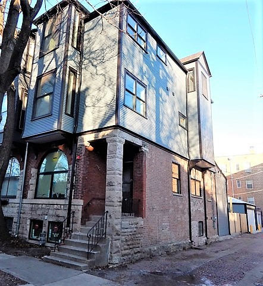
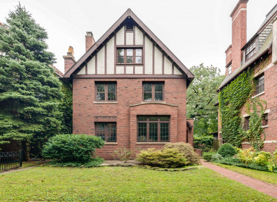
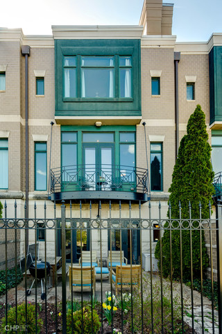
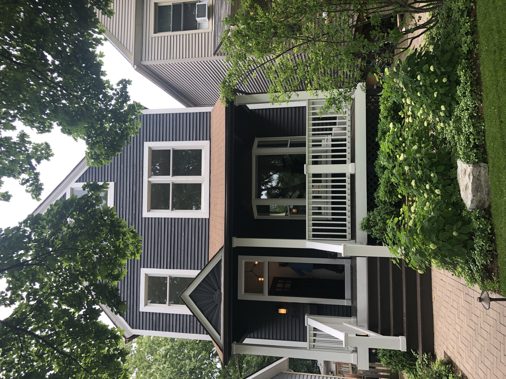
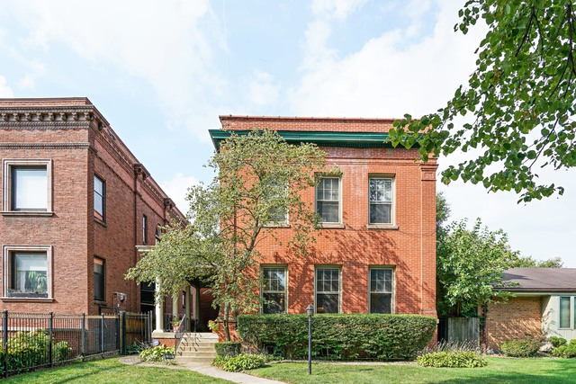
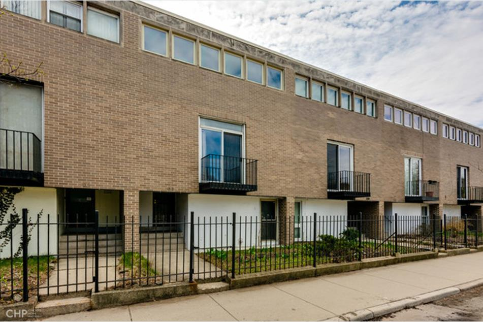
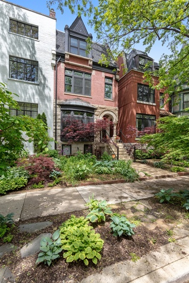
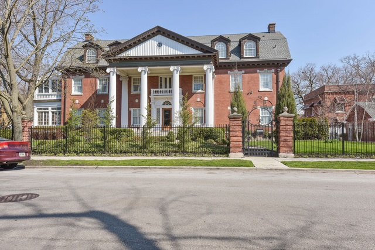
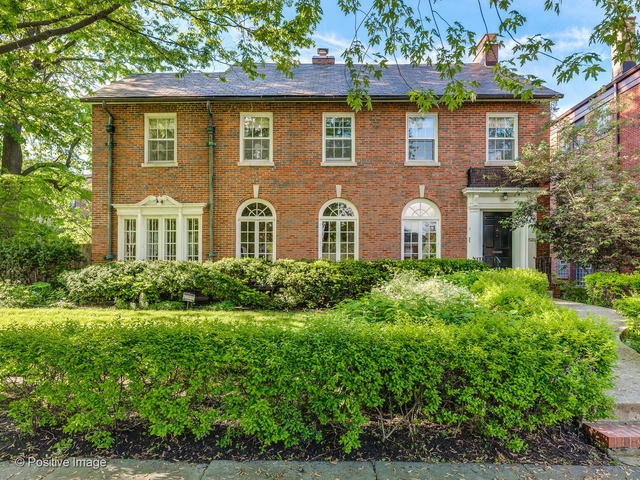

# Houses Visited

## 1316 E 52nd St 

[Link to PDF](https://www.dropbox.com/s/5i6m2m2lvddof0e/10394489.pdf?dl=0)

__Videos__:
[Single Video-all floors](https://www.dropbox.com/s/s43mbxyb0svda5v/10394489.MOV?dl=0)

__Listing Price__: $1,039,000  
__Lilliana's Price__: $850,000-$900,000

__Comments__: Lilliana thinks this is a quit flip job that is overpriced. While the rooms are light and the main floor is pretty good, lots of details are not finished. All the upstairs rooms are not well-thought out (weird shapes, vents positioning makes it hard to place beds, small bedrooms vs large bathrooms).

## 4305 S Greenwood Ave 

[Link to PDF](https://www.dropbox.com/s/2rvp186xtwd3rjc/10375148.pdf?dl=0)

__Videos__: 
- [Main Floor](https://www.dropbox.com/s/mcd3q0utjonxord/IMG_7741.MOV?dl=0)
- [First Floor](https://www.dropbox.com/s/c5azzjabzjsbp0y/IMG_7742.MOV?dl=0)
- [Second Floor](https://www.dropbox.com/s/0kryu4a58fxsbal/IMG_7743.MOV?dl=0)

__Listing Price__: $975,000  
__Lilliana's Price__: $850,000-$900,000

__Comments__: Big house with beautiful garden. Right next to Bana's house. Old. Needs a lot of work, including tearing down walls around kitchen, redoing kitchen, demolishing back patio, replacing with deck and balcony.

## 4940 S Lake Shore Dr Unit B

[Link to PDF](https://www.dropbox.com/s/u02yoikat4jy7ay/10364825.pdf?dl=0)

__Videos__:
- [First Floor](https://www.dropbox.com/s/j5ncjkxzy738p5a/IMG_7746.MOV?dl=0)
- [Second+Third Floor](https://www.dropbox.com/s/ubnm3rltu4jy3rc/IMG_7747.MOV?dl=0)

__Listing Price__: $965,000

__Comments__: This is one is simple and functional, but requires driving everywhere.

## 5461 S Ridgewood Ct

[Link to PDF](https://www.dropbox.com/s/gouq0yv0ccb52gh/10415444.pdf?dl=0)

__Videos__:
- [First Floor](https://www.dropbox.com/s/xii5ul31k5jb46h/IMG_7748.MOV?dl=0) 
- [Second Floor](https://www.dropbox.com/s/6wpnoiznlv31wn6/IMG_7749.MOV?dl=0)
- [Third Floor](https://www.dropbox.com/s/1a09kszbn2b6w25/IMG_7750.MOV?dl=0)
- [Basement](https://www.dropbox.com/s/dhs0gqmsae3tmfb/IMG_7752.MOV?dl=0)

__Listing Price__: $989,500  
__Lilliana's Price__: start at $950,000

__Comments__: No parking space is main issue, but street does not go through on both sides, so there is very little traffic and there is always space available on street. I like the location a lot, very near good park and both the university and the restaurants and store on 53rd. .8 mile to Earl Shapiro Lab School and .7 to main Lab School. Lilliana said renovation was "meticolous". Very good landscaping.

## 5016 S Ellis Ave

[Link to PDF](https://www.dropbox.com/s/96403xqfxowoc9m/10070491.pdf?dl=0)

__Videos__:  
- [First Floor](https://www.dropbox.com/s/m8d363wjesiuigl/IMG_7755.MOV?dl=0)
- [Second Floor](https://www.dropbox.com/s/ge0hmmqpj30y1gw/IMG_7757.MOV?dl=0)
- [Basement](https://www.dropbox.com/s/0zg5tn0dczme9hc/IMG_7758.MOV?dl=0)

__Listing Price__: $1,285,000  
__Lilliana's Price__: $1,150,000

__Comments__: The most reasonable of the big houses in my opinion. Very nice kitchen and yard. Kid's bedrooms and basement a bit underwhelming at this price.

## 1313 E 55 St 

[Link to PDF](https://www.dropbox.com/s/871d4vdn0uhnfxr/10351104.pdf?dl=0)

__Videos__: [Single Video](https://www.dropbox.com/s/ap0gk24o8w0ycu1/IMG_7759.MOV?dl=0)

__Listing Price__: $649,000  

__Comments__: Cheap and convenient. One reserved outside spot in the back. Very few windows and little space for Audrey, but functional interior otherwise.

## 1340 E Madison Park

[Link to PDF](https://www.dropbox.com/s/cemri4f58ck2zdn/10401302.pdf?dl=0)

__Videos__: 
- [Second+Third Floor](https://www.dropbox.com/s/z73ruuesqnd8c47/IMG_7760.MOV?dl=0)
- [First Floor](https://www.dropbox.com/s/sys470zc308ljup/IMG_7762.MOV?dl=0)

__Listing Price__: $1,495,000  
__Lilliana's Price__: $1,350,000 at most

__Comments__: Very nice location, with private park, near WF and stores. Garage and little yard. However, house is very narrow and spaces are not the most usable. It does have an elevator.

## 1000 E 48th St

[Link to PDF](https://www.dropbox.com/s/ay0xnwxtdwvnwof/10275431.pdf?dl=0)

__Videos__:
- [Ground + First Floor](https://www.dropbox.com/s/rqywuyxo4i98r8n/IMG_7763.MOV?dl=0)
- [Second Floor](https://www.dropbox.com/s/j5ls0i3yw9aqxmk/IMG_7764.MOV?dl=0)

__Listing Price__: $1,525,000

__Comments__: Very large house. So big I cannot quite keep track of how many rooms there are.

## 1120 E 50th St

[Link to PDF](https://www.dropbox.com/s/ssu12juv275d788/10407759.pdf?dl=0)

__Videos__:  
 - [Second Floor](https://www.dropbox.com/s/bfr9ucg67yri4wy/IMG_7767.MOV?dl=0)  
 - [First Floor](https://www.dropbox.com/s/e0wmz5rbz4q3nvs/IMG_7768.MOV?dl=0)

__Comments__: Nice house with no garage, but great yard. Windows need to be replaced but cannot be altered bc of historical status.
